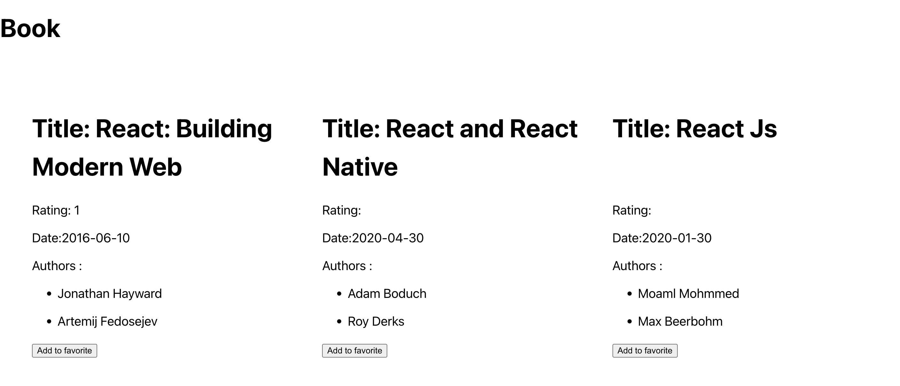
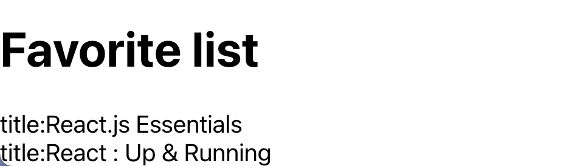

# React assignment

### How to run project

1. Step 1: yarn
2. Step 2: yarn start

### Requirements

1. Fetch data from the url `https://www.googleapis.com/books/v1/volumes?q=react`

2. Display the book list on the screen as screenshot below:
   

3. When user click `add to favorite` button, the book's title show up in the Favorite list
   
